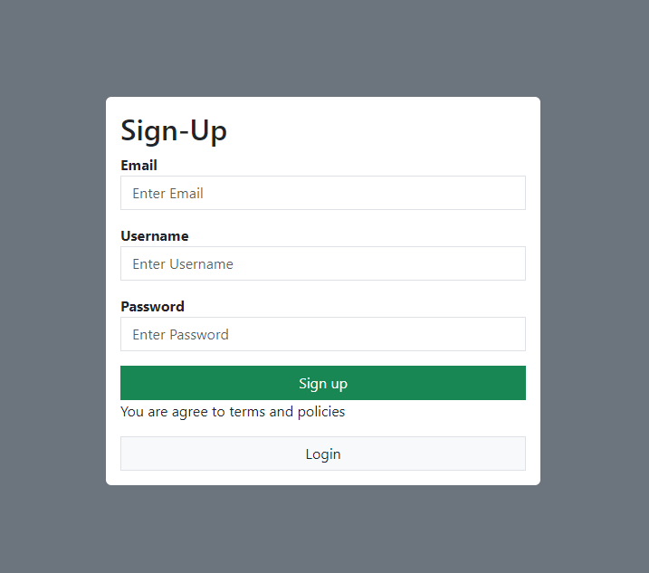
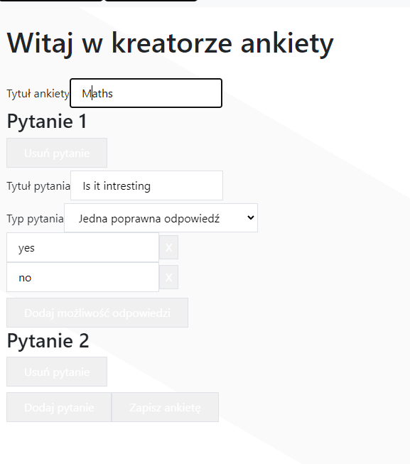
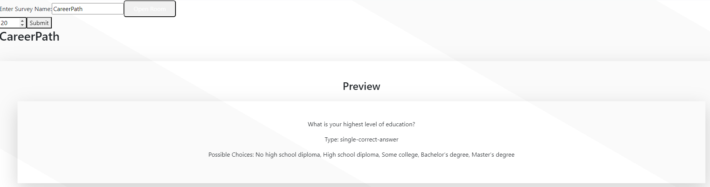
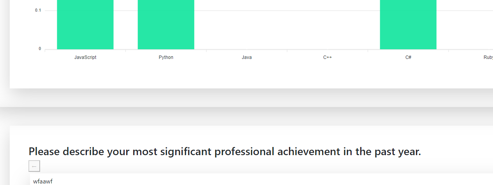

# Interactive Survey Management App

## Description

The Interactive Survey Management App is designed for creating, managing, and sharing surveys, as well as collecting and analyzing responses from completed surveys.

## Features

- **Create surveys:** Design custom surveys tailored to your specific needs.
- **Manage surveys:** Easily edit, delete, or update existing surveys.
- **Share surveys:** Distribute your surveys via email, links, or social media platforms.
- **Collect responses:** Efficiently gather and analyze data from user responses.

## Usage

1. **Sign up or log in** to your account.
   
   
2. **Create a new survey** by adding questions and answer options.
   
   
3. **Share the survey** via a link or email to participants.
   
   
4. **Monitor responses** and analyze the collected data.
   

## Technologies Used

- **Frontend:** React
- **Backend:** NestJS
- **Database:** Postgres

## Installation

1. Clone the repository:

    ```bash
    git clone https://github.com/Banjo7331/BackendForAQuizApplication_in_NestJS.git
    ```

2. Navigate to the backend directory:

    ```bash
    cd backend-for-survey
    ```

3. Install the dependencies:

    ```bash
    npm install
    ```

4. Start Docker container:

    ```bash
    docker-compose up --build
    ```

5. Configure the `.env` file with your database settings (add it in backend folder):

    ```
    DATABASE_TYPE=postgres
    DATABASE_HOST=postgres_db
    DATABASE_PORT=5432
    DATABASE_USERNAME=testuser
    DATABASE_PASSWORD=testuser123
    DATABASE_NAME=post_db5
    ```

6. If want to clenout everything in docker container do this:

    ```bash
    docker-compose down -v
    ```

## Contribution

Contributions are welcome! Please follow these steps:

1. Fork the repository.
2. Create a new branch (`git checkout -b feature/your-feature-name`).
3. Make your changes.
4. Commit your changes (`git commit -m 'Add your feature'`).
5. Push to the branch (`git push origin feature/your-feature-name`).
6. Open a Pull Request.

By contributing, you agree that your contributions will be licensed under the same license as the project.


